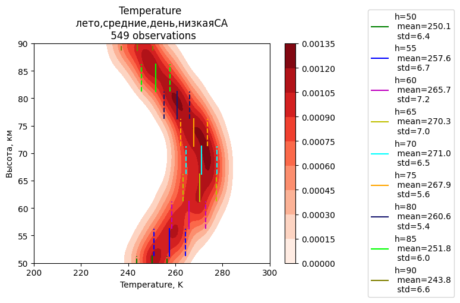

# Моделирование нижней геосферы земли
Босинзон Галина, 734 группа
## Исходные данные
Наблюдения со спутника AURA лежат в файле `data/data.mat`

Также в папке `data` лежат эти данные в текстовом виде

Изобразим распределения данных по _сезонам, регионам, временам суток и солнечной активности_:

```shell script
$ python3 python_code/create_data_hist.py --param season
$ python3 python_code/create_data_hist.py --param region
$ python3 python_code/create_data_hist.py --param SZA
$ python3 python_code/create_data_hist.py --param F107
```


## Распределение плотностей вероятностей T и M от условий
### Зависимость от солнечной активности
Рассмотрим, как изменится распределение вероятности **температуры** нейтралов летним днем в экваториальных широтах 
в зависимости от солнечной активности:


Можно заметить, что здесь **среднее значение температуры от солнечной активности практически не зависит**.
Однако, можем заметить, что при высокой солнечной активности разброс значений больше

Сравним еще распределения летним днем в средних широтах:




Наблюдаем аналогичную картину: средние значения при высокой и низкой СА расходятся не
значительно, но разброс значений при высокой СА больше, чем при низкой

Теперь построим в этих же условиях распределение плотности вероятности **концентрации нейтралов**:


Можно заметить, что
**распределение плотности вероятности концентрации нейтралов от солнечной активности зависит несущественно**

>**_Вывод:_**  
>* распределение P(M) от солнечной активности практически не зависит
>* среднее значение T от солнечной активности зависит не существенно, однако,
>вероятностное распределение P(T) немного меняется в зависимости от СА


### Зависимость от времени суток
Так как была выявлена зависимость распределения плотности вероятности температуры от солнечной активности,
необходимо снова проверять зависимость распределения плотности вероятности температуры от времени суток 
при замороженных  остальных параметрах. Больше всего наблюдений летом на экваторе 
при низкой СА, при этих параметрах и будем проверять:


В обоих случаях количество наблюдений большое, и картинки наблюдаются схожие

На этих же данных посмотрим распределение вероятности концентрации нейтралов


Можно заметить, что на высотах h > 75 км ночью разброс значений чуть больше, чем днем, 
но отличия не существенны

>**_Вывод:_**  
>Распределения P(T) и P(M) от времени суток зависят не существенно

### Зависимость от широты
Построим распределение плотности вероятности температуры нейтралов в летний день
при низкой СА для экваториальных, средних и полярных широт


Видно, что разброс значений температуры возрастает при приближении к полярным широтам.
Причем от региона зависят и средние значения температуры

Для распределения плотности вероятности концентрации нейтралов:


Разброс значений концентрации нейтралов так же увеличивается при приближении к 
полярным широтам. Меняются и средние значения M

>**_Вывод:_**  
>Распределения P(T) и P(M) зависят от широты

### Зависимость от сезона
Рассмотрим зиму и лето в полярных широтах при низкой СА (время суток опустим, так как в
этих широтах все лето и всю зиму время суток не меняется, да и выше было доказано, что от
времени суток распределения практически не зависят):


Сезонная зависимость температуры ярко выражена.

Проверим еще для четырех времен года в средних широтах:


Самый большой разброс температур наблюдается зимой, наименьший - летом.

_Этот эксперимент подтверждает так же предыдущее утверждение о широтной зависимости
распределения плотности вероятности температуры (в полярных широтах более заметна
разница между зимним и летним распределением)_

Проверим сезонную зависимость распределения плотности концентрации нейтралов:


Зимой разброс значений больше, чем летом


Опять же, наибольший разброс получился зимой, а наименьший - летом.

>**_Вывод:_**  
>Распределения P(T) и P(M) зависят от сезона