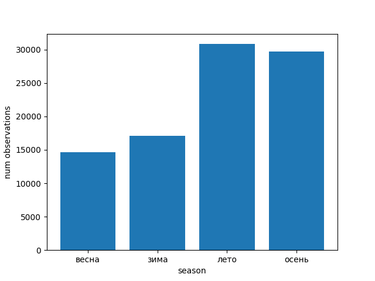
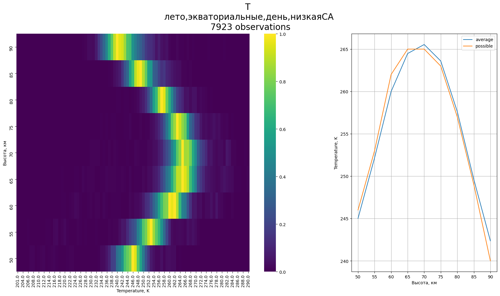
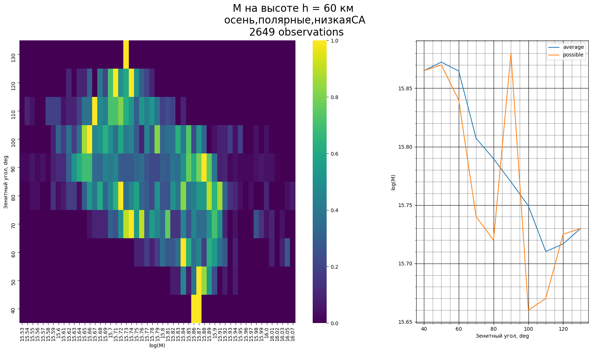
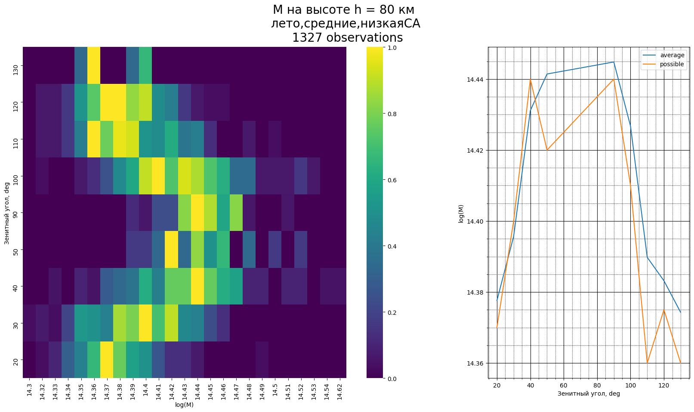
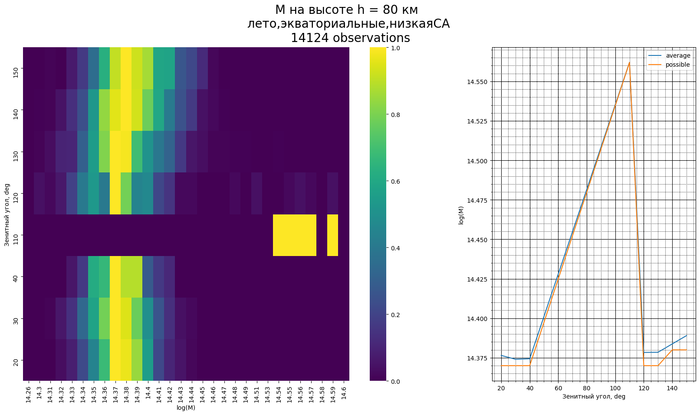
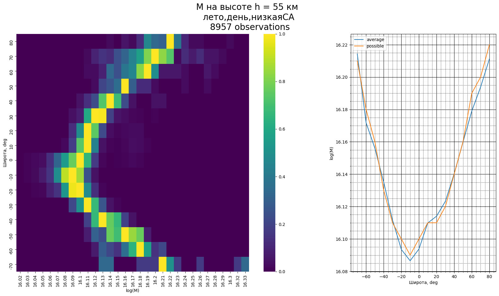
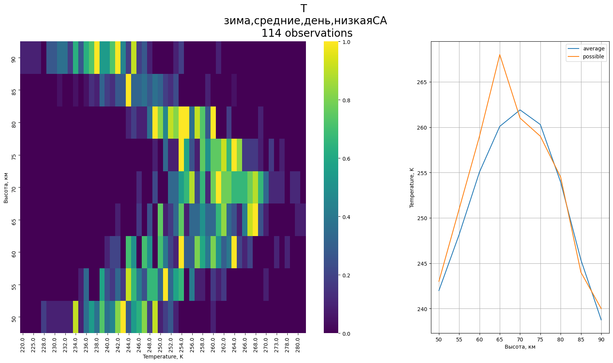

# Моделирование нижней геосферы земли
Босинзон Галина, 734 группа
## Код
Основной код, используемый для выполнения проекта, лежит в директории `python_code`

### Функция create_dataset
```python
def create_grouped_dataset(mat_file: str, param: str, filter_expr='1 = 1') -> DataFrame:
    """
    Функция, генерирующая из .mat-файла датафрэйм для параметра, отбирая записи по условию
    :param mat_file: путь к .mat файлу
    :param param: какой параметр считаем (Temperature или M)
    :param filter_expr: условие
    :return: DataFrame
    """
```
Функция создает датасет из `.mat`-файла, в котором сырые данные файла пересчитаны
в нужные значения `season`, `region`, `SZA` и `F107`. 
На выходе датасет дополнен значениями температуры или концентрации нейтралов (в
зависимости от переданного значения `param`), а также отобраны только нужные записи
с помощью фильтра `filter_expr`

Расчет значений `season`, `region`, `SZA` и `F107` и фильтрация производятся
с помощью sql-запроса:

```sql
    select * from (
    select 
    case when month in (11, 12, 1) and shirota > 0 
            or month in (5, 6, 7) and shirota < 0 then 'зима'
        when month in (2, 3, 4) and shirota > 0
            or month in (8, 9, 10) and shirota < 0 then 'весна'
        when month in (5, 6, 7) and shirota > 0 
            or month in (11, 12, 1) and shirota < 0 then 'лето'
        when month in (8, 9, 10) and shirota > 0
            or month in (2, 3, 4) and shirota < 0 then 'осень'
    end season
    , case when abs(shirota) > 60 then 'полярные'
          when abs(shirota) < 30 then 'экваториальные'
         else 'средние'
    end region
    , case when F107 < 100 then 'низкаяСА'
        when F107 > 150 then 'высокаяСА'
        else 'средняяСА'
    end F107
    , case when SZA < 60 then 'день'
        when SZA > 100 then 'ночь'
        else 'сумерки'
    end SZA
    
    , {{col_name}}
    
    from summary
    ) t where {{filter_query}}
```

### Класс KdeBuilder

```python
class KdeBuilder:
    """
    Класс для визуализации данных
    """

    def __init__(self, mat_file, param, **kwargs):
```
При инициализации передаются параметры:
* `mat_file` - путь к файлу с исходными данными
* `param` - что рассчитываем (`Temperature` или `M`)
* `**kwargs` - значения `season`, `region`, `SZA` и `F107` , если по ним нужен отбор

Во время инициализации создается датасет из файла.

Для построения графика необходимо вызвать метод `create_plot`

```python
    def create_plot(self, file, x_label=None, y_label='Высота, км'):
        """
        Метод, строящий график
        :param file: куда сохранять файл
        :param x_label: подпись оси x
        :param y_label: подпись оси y
        :return:
        """
```

### Утилита cli.py
Сделана для удобства вызова построения графиков

Вызывается с опциями, соответствующими критериям фильтра.

```sh
usage: cli.py [OPTIONS] PARAM
```

`PARAM` - `T` или `M` в зависимости от того, что мы хотим рассчитать

`OPTIONS`:

|Опция| возможные значения |
|-----|------|
|--season|лето, зима, осень, весна|
|--region|экваториальные, средние, полярные|
|--sza|день, ночь, сумерки|
|--f107|низкаяСА, высокаяСА, средняяСА|
 
_Примеры:_

* Построеение графика плотности вероятности температуры нейтралов летом в полярных широтных, днем, при низкой солнечной активности

```sh 
$ python3 cli.py T --season лето --region полярные --sza день --f107 низкаяСА
```

* Построение графика плотности вероятности концентрации нейтралов зимой в средних широтах (для всех времен суток и СА):

```shell 
$ python3 cli.py M --season зима --region средние
```

**График сохраняется в директории `images` c названием**
```python 
f'images/{param}-{"-".join([value for value in kwargs.values() if value])}.png'
```
## Исходные данные
Наблюдения со спутника AURA лежат в файле `data/data.mat`

Также в папке `data` лежат эти данные в текстовом виде

Изобразим распределения данных по _сезонам, регионам, временам суток и солнечной активности_:

```shell script
$ python3 python_code/create_data_hist.py --param season
$ python3 python_code/create_data_hist.py --param region
$ python3 python_code/create_data_hist.py --param SZA
$ python3 python_code/create_data_hist.py --param F107
```




## Распределение плотностей вероятностей T и M от условий
В этом разделе будем строить распределения плотности вероятности T и M и графики зависимостей
среднего и наиболее вероятного значения этих параметров от высоты h при различных гелиофизических условиях,
а так же графики зависимостей этих величин от гелиофизических условий.

На иллюстрациях этого раздела слева будут изображены распределения плотности вероятности величины,
нормированной на максимальное значение, а справа - графики среднего и наиболее
вероятного значения величины.

### Зависимость от солнечной активности
Рассмотрим, как изменится распределение вероятности температуры нейтралов летним днем в экваториальных широтах 
в зависимости от солнечной активности:




Дисперсия значений при высокой СА больше, чем при низкой. Возможно, это связано с меньшим количеством наблюдений.
Тем не менее, наиболее вероятные значения близки к средним.

Сравним еще распределения летним днем в средних широтах:


Снова разброс значений при высокой СА больше, чем при низкой, однако, в данном случае средние величины сильнее отличаются
от вероятных, чем в предыдущем.

Построим зависимость распределения температуры нейтралов от солнечной активности
(например, на высоте h= 50 км):


Для обоих регионов наблюдается минимум при f107 около 140, но в целом четкой зависимости 
температуры от солнечной активности не наблюдается.


Теперь построим в этих же условиях распределение плотности вероятности концентрации нейтралов:


При высокой СА дисперсия значений больше, чем при низкой. При этом, во всех случаях наиболее вероятные
значения практически совпадают со средними.

Построим зависимость распределения концентрации нейтралов
от солнечной активности:


Колебания концентрации не значительны.

_При высокой солнечной активности разброс значений T и M гораздо больше, чем при низкой. Кроме того, для высокой СА
мы имеем небольшое количество наблюдений. Поэтому в следующих экспериментах будем выбирать значения при низкой СА._


### Зависимость от времени суток
Наиболее показательным примером будет рассмотреть распределения величин ночью и днем 
в экваториальных широтах в межсезонье, так как день примерно равен ночи, и на экваторе 
наблюдается наибольший разброс значений зенитных углов.


Ночью разброс значений больше, чем днем. Причем днем средние значения практически совпадают с наиболее вероятными, а
ночью на некоторых высотах заметны различия между средними и наиболее вероятными температурами.

Построим зависимости распределения температуры нейтралов 
от зенитного угла:


Эти графики показывают, что существует зависимость температуры от зенитного угла.

На этих же данных посмотрим распределение вероятности концентрации нейтралов


Осенью на экваторе наиболее вероятные значения M совпадают со средними. При этом, 
наблюдается, что дисперсия значений растет при увеличении высоты как днем, так и ночью.

Построим зависимость распределения концентрации нейтралов от зенитного угла





Зависимость наиболее вероятной концентрации от зенитного угла наблюдается, но не существенная.

Резкий разрыв на экваторе в районе зенитного угла в 90 градусов объясняется тем, что на экваторе сумерки
продолжаются недолго, и при зенитных углах около 90 имеем малое количество наблюдений.


### Зависимость от широты
Построим распределение плотности вероятности температуры нейтралов в летний день
при низкой СА для экваториальных, средних и полярных широт


Заметим, что дисперсия значений температуры наибольшая в средних широтах, а
различия в распределениях для разных регионов видны невооруженным взглядом.

Кроме того, наиболее вероятные значения не совпадают со средними, особенно в средних широтах.

Построим распределение температуры нейтралов от широты:


Зависимость температуры от широты ярко выражена, особенно летом и зимой.

Для распределения плотности вероятности концентрации нейтралов:


Разброс значений концентрации нейтралов так же наибольший в средних широтах.

Наиболее вероятные значения концентрации почти совпадают с наиболее вероятными в экваториальных и полярных широтах,
но в средних широтах все же различаются, хоть и не существенно.

Зависимости концентрации от широты:




Видно, что есть зависимость концентрации нейтралов от широты.

### Зависимость от сезона
Сравним распределения по четырем сезонам в средних широтах:




Самый большой разброс температур наблюдается зимой, наименьший - летом.

Построим зависимость распределения температуры от месяца в северном полушарии:


Проверим сезонную зависимость распределения плотности концентрации нейтралов

Зимой разброс значений больше, чем летом


Опять же, наибольший разброс получился зимой, а наименьший - летом.

Зависимость концентрации от месяца:


>**_Вывод:_**  
>Распределения P(T) и P(M) зависят от сезона


