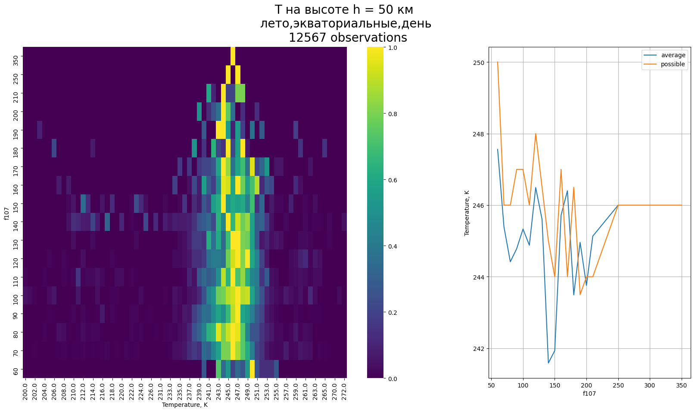
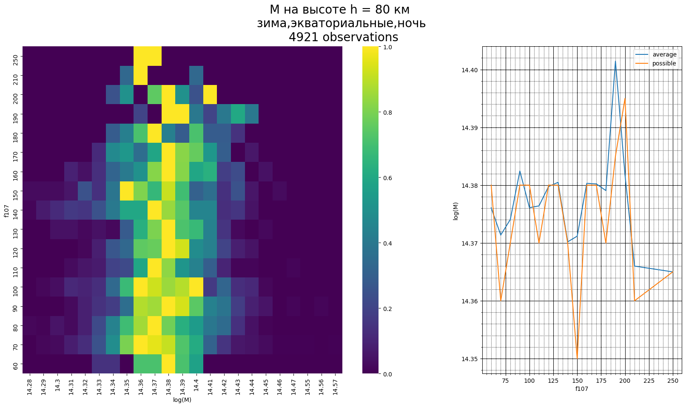
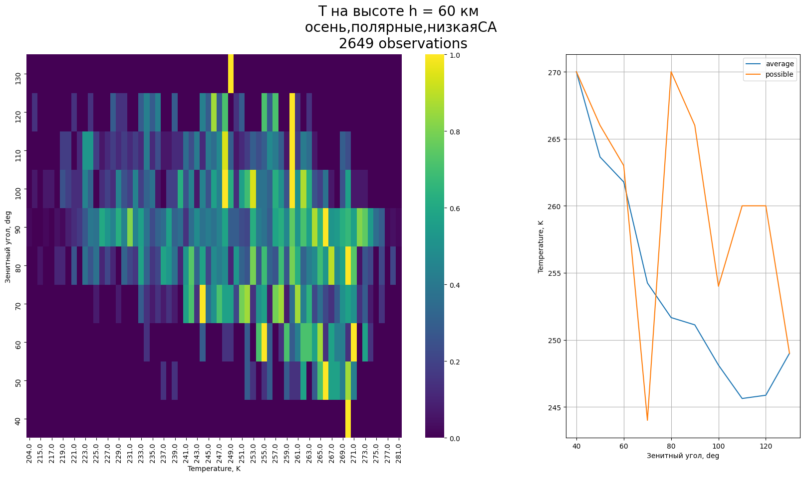
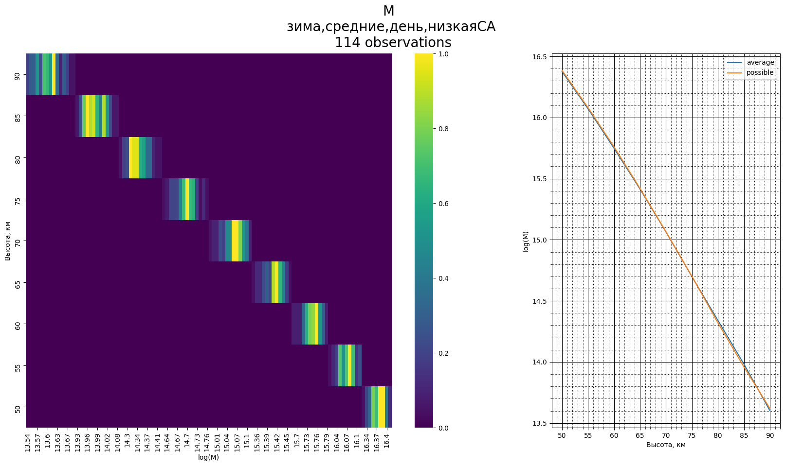

# Моделирование нижней геосферы земли
Босинзон Галина, 734 группа

**Содержание:**

1. [Цели, задачи и актуальность](#target)
2. [Краткая теория](#theory)
3. [Код](#code)
4. [Исходные данные](#data)
5. [Распределение плотностей вероятностей T и M от условий](#relation)
    - [От солнечной активности](#f107)
    - [От времени суток](#sza)
    - [От широты](#latitude)
    - [От сезона](#season)
6. [Сравнение рассчитанных значений со значениями модели MSIS](#msis)
7. [Выводы](#conclusion)
## Цели, задачи и актуальность <a name="target"></a>
### Цель работы:
Исследовать зависимость температуры и концентрации нейтральной атмосферы от гелиогеофизических условий 
на основании спутниковых данных и результатов модели MSIS.
### Задачи:
1. Исследовать высотные профили спутниковых измерений температуры T и общей концентрации нейтралов M на высотах нижней ионосферы в различных гелиогеофизических условиях. Построить функции плотности вероятности T и M от 50 до 90 км с шагом 5 км для 4 сезонов, 3 диапазонов широт, 3 уровней солнечной активности, 2 диапазонов солнечного зенитного угла.
2. Сравнить наиболее вероятные величины и средние значения параметров. Сделать вывод о необходимости перехода к вероятностным характеристикам при определении значений температуры и концентрации нейтральной атмосферы.
3. Сопоставить рассчитанные по спутниковым данным значения T и M с профилями, полученными из модели атмосферы MSIS. Проверить обнаруженные ранее суточные, сезонные, широтные и др. зависимости по данным модели MSIS. Сделать вывод о применимости результатов модели MSIS для решения задач моделирования ионосферных слоев.
### Актуальность:
К настоящему моменту имеются различные теоретические оценки и экспериментальные данные о пространственных 
распределениях параметров ионосферы, однако точно точность предсказания их поведения достаточно мала.

В данной работе будет проверяться применимость модели MSIS, в результате чего станет понятно, можно ли использовать
эту модель при решении задач моделирования нижних слоев ионосферы или необходимо учитывать вероятностное распределение
данных со спутника.

## Краткая теория <a name="theory"></a>
**Ионосфера** - слой атмосферы планеты, сильно ионизированный вследствие облучения космическими лучами

**D-слой ионосферы** - слой ионосферы на высоте от 50 км до 90 км. _Область слабой ионизации_.

В текущей работе будет исследоваться D-слой ионосферы.

Источники излучения в D-слое:
* рентгеновское излучение Солнца (основной вклад)
* метеориты, сгорающие на высотах 60—100 км
* космические лучи 
* энергичные частицы магнитосферы (заносимые в этот слой во время магнитных бурь)

_Слой D также характеризуется резким снижением степени ионизации в ночное время суток._

**Нейтралы** - нейтральные частицы в ионосфере, преимущественно  и 
.

Из уравнения состояния идеального газа концентрацию нейтралов будем считать как 


Разбиение на **сезоны** будем считать следующим запросом:
```sql
case when month in (11, 12, 1) and latitude > 0 
            or month in (5, 6, 7) and latitude < 0 then 'зима'
    when month in (2, 3, 4) and latitude > 0
            or month in (8, 9, 10) and latitude < 0 then 'весна'
    when month in (5, 6, 7) and latitude > 0 
            or month in (11, 12, 1) and latitude < 0 then 'лето'
    when month in (8, 9, 10) and latitude > 0
            or month in (2, 3, 4) and latitude < 0 then 'осень'
end season
```

Разбиение на **регионы**:
```sql
case when abs(latitude) > 60 then 'полярные'
          when abs(latitude) < 30 then 'экваториальные'
         else 'средние'
end region
```

Разбиение на **время суток**:
```sql
case when SZA < 60 then 'день'
        when SZA > 100 then 'ночь'
        else 'сумерки'
end SZA
```

Разбиение по **солнечной активности**:
```sql
case when F107 < 100 then 'низкаяСА'
        when F107 > 150 then 'высокаяСА'
        else 'средняяСА'
end F107
```
## Код <a name="code"></a>
- Основной код, используемый для выполнения проекта, лежит в директории `python_code`
- sql-запросы для отбора данных лежат в директории `sql`

### Функция create_dataset
```python
def create_dataset(mat_file: str, param: str, sql_file_path: str, **kwargs) -> DataFrame:
    """
    Функция, генерирующая из .mat-файла датафрэйм для параметра, отбирая записи по условию
    :param mat_file: путь к .mat файлу
    :param param: какой параметр считаем (T или M)
    :param sql_file_path: путь к sql файлу
    :return: DataFrame
    """
```
Функция создает датасет из `.mat`-файла, доставляя в `sql_file_path` данные `param` и `**kwargs`
 
На выходе датасет дополнен значениями температуры или концентрации нейтралов (в
зависимости от переданного значения `param`), а также отобраны только нужные записи
с помощью фильтра `filter_expr`


### Класс KdeBuilder

```python
class KdeBuilder:
    """
    Класс для визуализации данных
    """

    def __init__(self, mat_file, param, **kwargs):
```
При инициализации передаются параметры:
* `mat_file` - путь к файлу с исходными данными
* `param` - что рассчитываем (`Temperature` или `M`)
* `**kwargs` - значения `season`, `region`, `SZA` и `F107` , если по ним нужен отбор


Построение графиков распределения плотности вероятности и зависимости средних и вероятных величин от параметра
вызывается методом `create_plot`

```python
    def create_plot(self, image_file: str, y_param='h', x_label=None, y_label=None, plt_tittle=None):
        """
        Метод, строящий график распределения плотности вероятности и график  зависимости средних и вероятных
        величин от y_param
        :param image_file: куда сохранять файл        
        :return:
        """
```

Для сравнения данных спутника с данными модели MSIS вызывается метод `create_compare_plot`
```python
    def create_compare_plot(self, datafile, image_file):
        """
        Построение зависимостей от h среднего значения, наиболее вероятного и значения из модели MSIS
        :param datafile: файл с данными MSIS
        :param image_file: куда сохранять
        """
```

### Утилита cli.py
Сделана для удобства вызова построения графиков

Вызывается с опциями, соответствующими критериям фильтра.

```sh
usage: cli.py [OPTIONS] PARAM
```

`PARAM` - `T` или `M` в зависимости от того, что мы хотим рассчитать, если строится зависимость от высоты h.

Если необходимо построить зависимость от другого параметра, то надо передать `PARAM=[TM][высота]` и опцию
`--y [latutude|month|sza|f107]`

Для фильтрации передаются опции:

|Опция| возможные значения |
|-----|------|
|--season|лето, зима, осень, весна|
|--region|экваториальные, средние, полярные|
|--sza|день, ночь, сумерки|
|--f107|низкаяСА, высокаяСА, средняяСА|

Чтобы построить сравнение с данными MSIS, необходимо передать флаг `--msis`
 
_Примеры:_

* Построеение графика плотности вероятности температуры нейтралов летом в полярных широтных, днем, при низкой солнечной активности

```sh 
$ python3 cli.py T --season лето --region полярные --sza день --f107 низкаяСА
```

* Построение графика плотности вероятности концентрации нейтралов зимой в средних широтах (для всех времен суток и СА):

```shell 
$ python3 cli.py M --season зима --region средние
```

* Построение зависимости плотности вероятности температуры на высоте 50 км от широты весной, днем, при низкой СА:

```shell 
$ python3 cli.py T85 -y latitude --season весна --sza день --f107 низкаяСА
```

* Сравнение рассчитанной концентрации с моделью MSIS (зимой в средних широтах при низкой СА):
```shell 
$ python3 cli.py M --msis --season зима --region средние --sza день --f107 низкаяСА 
```
_График сохраняется в директории_ `images/by_{param}`

## Исходные данные <a name="data"></a>
Наблюдения со спутника AURA лежат в файле `data/data.mat`.
Также в папке `data` лежат эти данные в текстовом виде

Данные модели MSIS лежат в файлах `data/*.txt`

Изобразим распределения данных по _сезонам, регионам, временам суток и солнечной активности_:

```shell script
$ python3 python_code/create_data_hist.py --param season
$ python3 python_code/create_data_hist.py --param region
$ python3 python_code/create_data_hist.py --param SZA
$ python3 python_code/create_data_hist.py --param F107
```


## Распределение плотностей вероятностей T и M от условий <a name="relation"></a>
В этом разделе будем строить распределения плотности вероятности T и десятичного логарифма M и графики зависимостей
среднего и наиболее вероятного значения этих параметров от высоты h при различных гелиофизических условиях,
а так же графики зависимостей этих величин от гелиофизических условий.

На иллюстрациях этого раздела слева будут изображены распределения плотности вероятности величины,
нормированной на максимальное значение, а справа - графики среднего и наиболее
вероятного значения величины.

Чтобы по графику логарифма определить разницу значений M воспользуемся преобразованием:


### Зависимость от солнечной активности <a name="f107"></a>
Рассмотрим, как изменится распределение вероятности температуры нейтралов летним днем в экваториальных широтах 
в зависимости от солнечной активности:


Дисперсия значений при высокой СА больше, чем при низкой. Возможно, это связано с меньшим количеством наблюдений.
Тем не менее, наиболее вероятные значения близки к средним (в переделах 0.8%).

Сравним еще распределения летним днем в средних широтах:


Снова разброс значений при высокой СА больше, чем при низкой, однако, в данном случае средние величины сильнее отличаются
от вероятных, чем в предыдущем (в пределах 2%).

Построим зависимость распределения температуры нейтралов от солнечной активности
(например, на высоте h= 50 км):



Для обоих регионов наблюдается минимум при f107 около 140, с отклонением значения примерно на 8%.
Исключая этот минимум, колебания температуры не более 2%.

Для низкой солнечной активности значения колеблются в пределах 1,2%.


Теперь построим в этих же условиях распределение плотности вероятности концентрации нейтралов:


При высокой СА дисперсия значений больше, чем при низкой. При этом, в экваториальных широтах средние значения M совпадают
с наиболее вероятными (графики логарифмов накладываются друг на друга), а в средних широтах на высотах 60-80 км наблюдаются
различия средней и вероятной концентрации до 12%.

Построим зависимость распределения концентрации нейтралов
от солнечной активности:




Наблюдается колебание значений концентрации до 12%.

_При высокой солнечной активности разброс значений T и M гораздо больше, чем при низкой. Кроме того, для высокой СА
мы имеем небольшое количество наблюдений. Поэтому в следующих экспериментах будем выбирать значения при низкой СА._


### Зависимость от времени суток <a name="sza"></a>
Наиболее показательным примером будет рассмотреть распределения величин ночью и днем 
в экваториальных широтах в межсезонье, так как день примерно равен ночи, и на экваторе 
наблюдается наибольший разброс значений зенитных углов.


Ночью разброс значений больше, чем днем. Ночью средние температуры отклоняются от наиболее вероятных в пределах 0.8%,
а днем в пределах 0.7%.

Построим зависимости распределения температуры нейтралов 
от зенитного угла:




Эти графики показывают, что существует зависимость температуры от зенитного угла (колебания значений около 10%).

На этих же данных посмотрим распределение вероятности концентрации нейтралов


Осенью на экваторе наиболее вероятные значения M совпадают со средними (прямые десятичного логарифма 
накладываются друг на друга). При этом, 
наблюдается, что дисперсия значений растет при увеличении высоты как днем, так и ночью.

Построим зависимость распределения концентрации нейтралов от зенитного угла


Наблюдается зависимость наиболее вероятной концентрации от зенитного угла (колебания значения до 60%).

Резкий разрыв на экваторе в районе зенитного угла в 90 градусов объясняется тем, что на экваторе сумерки
продолжаются недолго, и при зенитных углах около 90 имеем малое количество наблюдений.


### Зависимость от широты <a name="latitude"></a>
Построим распределение плотности вероятности температуры нейтралов в летний день
при низкой СА для экваториальных, средних и полярных широт


Заметим, что дисперсия значений температуры наибольшая в средних широтах, а
различия в распределениях для разных регионов видны невооруженным взглядом.

В средних широтах наблюдается наибольшее отклонение средней температуры от наиболее вероятной.

Построим распределение температуры нейтралов от широты:


Зависимость температуры от широты существует (колебания значений в пределах 8%).

Для распределения плотности вероятности концентрации нейтралов:


Разброс значений концентрации нейтралов так же наибольший в средних широтах.

Наиболее вероятные значения концентрации совпадают с наиболее вероятными в экваториальных и полярных широтах,
но в средних широтах различаются на величину до 12%.

Зависимости концентрации от широты:


Наблюдается зависимость концентрации нейтралов от широты (колебания значений до 50%).

### Зависимость от сезона <a name="season"></a>
Сравним распределения по четырем сезонам в средних широтах:


Видим различия в распределениях. Заметим, что весной в межсезонье разница между средней и наиболее вероятной 
температурой достигает 3%.

Построим зависимость распределения температуры от месяца в северном полушарии:


Наблюдается зависимость температуры нейтралов от сезона (в пределах 8%).

Проверим сезонную зависимость распределения плотности концентрации нейтралов:





Опять же, летом и зимой разброс больше, чем в межсезонье.

Зависимость концентрации от месяца:


Наблюдается незначительная зависимость концентрации нейтралов от времени года 
(колебания значений до 50%)

## Сравнение рассчитанных значений со значениями модели MSIS <a name="msis"></a>

Сравним средние и наиболее вероятные значения T и M, рассчитанные на основании данных со спутника,
 со значениями модели MSIS:
 


Заметим, что модель температуры MSIS отличается от рассчитанной на значениях со спутника не только количественно, 
но и качественно.

Для концентрации модель отличается от рассчитанных значений количественно (например, на высоте 90 км значения отличаются
в 2 раза).

## Выводы <a name="conclusion"></a>
1.  
    - Распределение **температуры** нейтралов зависит от зенитного угла (разброс значений до 10%), а также от
    широты, времени года и солнечной активности (разброс значений в пределах 8%).
    - Наблюдается незначительная зависимость **концентрации** от широты, времени года и
    зенитного угла (колебания значений до 60%), а также зависимость значений концентрации от солнечной активности
    (в пределах 12%)
2.
    - Различие значений средней и наиболее вероятной **температуры** нейтралов при различных гелиофизических условиях
    находится в пределах 3%
    - Средние значения **концентрации** нейтралов близки к наиболее вероятным в экваториальных и полярных широтах, 
     но в средних различия достигают 12%
     
     Необходим переход от средних значений к вероятностному распределению.
3.  Рассчитанные M на данных со спутника отличаются от модели MSIS (на высоте 90 км разница достигает 100%), 
 а модель T отличается от данных со спутника
 не только количественно, но и качественно, из чего можно сделать вывод, что модель MSIS 
 неприменима для решения задач моделирования ионосферных слоев. 
