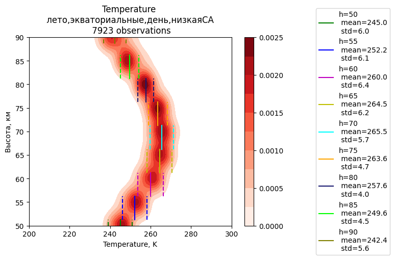

# Моделирование нижней геосферы земли
Босинзон Галина, 734 группа
## Проверка зависимостей T и M от условий
### Зависимость от солнечной активности
Рассмотрим, как изменится распределение **температуры** нейтралов летним днем в экваториальных широтах 
в зависимости от солнечной активности:

Можно заметить, что здесь **среднее значение температуры от солнечной активности практически не зависит**.
Однако можем заметить, что до h=70 км при выской СА разбор значений больше, чем при низкой, 
а выше h=75 км, наоборот, при высокой СА разброс значений становится меньше, чем при низкоой

Сравним еще распределения летним днем в средних широтах:

Наблюдаем аналогичную картину: средние значения при высокой и низкой СА расходятся не
значительно, но разброс значений при высокой СА больше, чем при низкой, до h=75 км и 
меньше, чем при низкой после h=75 км

Теперь построим в этих же условиях распределение **концентрации нейтралов**:

Можно заметить, что
**распределение концентрации нейтралов от солнечной активности зависит несущественно**

>**_Вывод:_**  
>* распределение M от солнечной активности практически не зависит
>* среднее значение T от солнечной активности зависит не существенно, однако,
>вероятностое распределение T меняется в зависимости от СА
